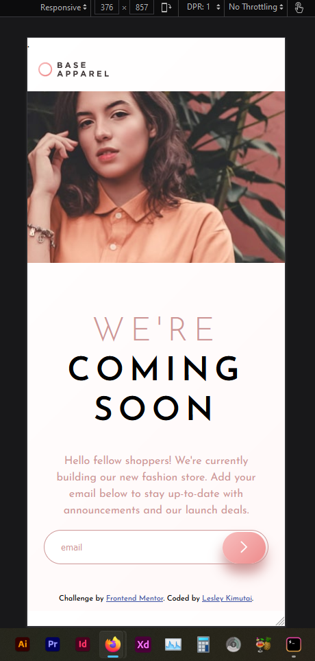
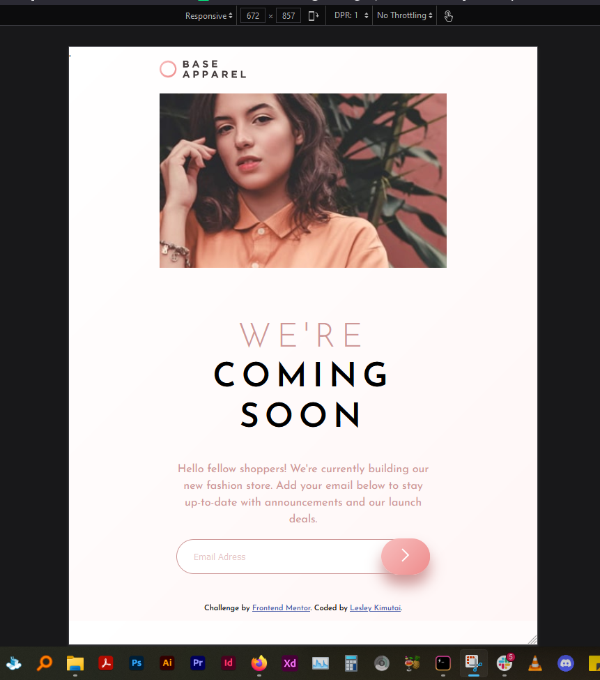
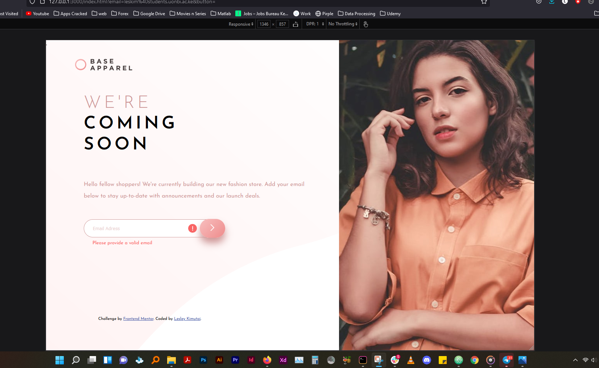

# Frontend Mentor - Base Apparel coming soon page solution

This is a solution to the [Base Apparel coming soon page challenge on Frontend Mentor](https://www.frontendmentor.io/challenges/base-apparel-coming-soon-page-5d46b47f8db8a7063f9331a0). Frontend Mentor challenges help you improve your coding skills by building realistic projects.

## Table of contents

- [Overview](#overview)
  - [The challenge](#the-challenge)
  - [Screenshot](#screenshot)
  - [Links](#links)
- [My process](#my-process)
  - [Built with](#built-with)
  - [What I learned](#what-i-learned)
  - [Continued development](#continued-development)
  - [Useful resources](#useful-resources)
- [Author](#author)
- [Acknowledgments](#acknowledgments)

## Overview

### The challenge

Users should be able to:

- View the optimal layout for the site depending on their device's screen size
- See hover states for all interactive elements on the page
- Receive an error message when the `form` is submitted if:
  - The `input` field is empty
  - The email address is not formatted correctly


### Screenshot

##### Mobile Design :-



- Above is the mobile design of the site☝🏽

##### Tablet Design :-



- Above is the tablet design of the site☝🏽


##### Laptop + Greater Screens Design :-



- Above is the laptop design of the site☝🏽


### Links

- Solution URL: [Solution Page ](https://github.com/issagoodlifeInc/base-apparel.git)
- Live Site URL: [Live Site](https://base-aparrel.netlify.app/)

## My process

### Built with

- Semantic HTML5 markup
- CSS custom properties
- Flexbox
- Mobile-first workflow
- Javascript


### What I learned


```css
.hero_img {
  //used it to handle the image being full view height 💪🏽
  background-image: url("../images/hero-desktop.jpg");
  background-size: cover;
  position: absolute;
  margin: 0;
  inset: 0 0 0 auto;
  height: 100vh;
  width: 40%;
}
```


### Continued development


 - Image Handling - Not sure to add them using css or html for the ones that change on responsiveness
 - Using the picture property in html ... seen that it handles @media well so will dive into that a bit later on
 - Javascript - Had to steal or rather borrow a whole code from @Ali in the acknowledgment section jus to handle a simple thing 😓


### Useful resources


- [W3Schools](https://www.w3schools.com/css/css3_backgrounds.asp) - Helped me get a better understanding of how background positions work -- my guy on all things alien 💯.

## Author


- Website - [Lesley Kimutai](https://linktr.ee/les_kim)
- Frontend Mentor - [Leskim](https://www.frontendmentor.io/profile/Leskim)
- GitHub - [Leskim](https://github.com/Leskim)


## Acknowledgments

 - Ali Abuhumra:-
 - Just a guy who did the project , saw his code to get tips on the email validation part 🤜🏽 He won't know but Thanks [Ali Abuhumra](https://github.com/Aliabuhumra)
